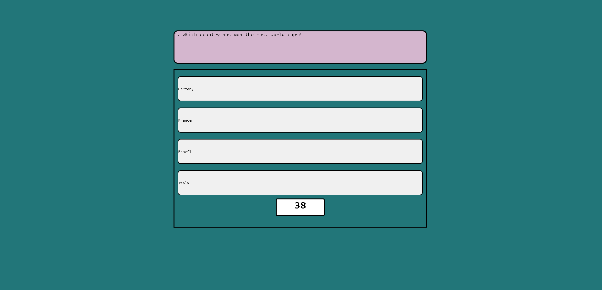

# EvanFodemsi-Project4
Fourth Project for DU bootcamp.

## Description
I tried my best on this project. It was a hug learning expierience and at this point I am completely lost. Sure I could have gone on the web and just copied things down, I guess, but that is not the learning expierience I am looking to achieve. I knoiw now that this coming week I have a lot of time to spend working on various things. In this project I managed to  complete the start page, the questions, and the timer.

## Screenshot

## Link to Deployed Application

https://evanfodemski.github.io/EvanFodemski-Project4/